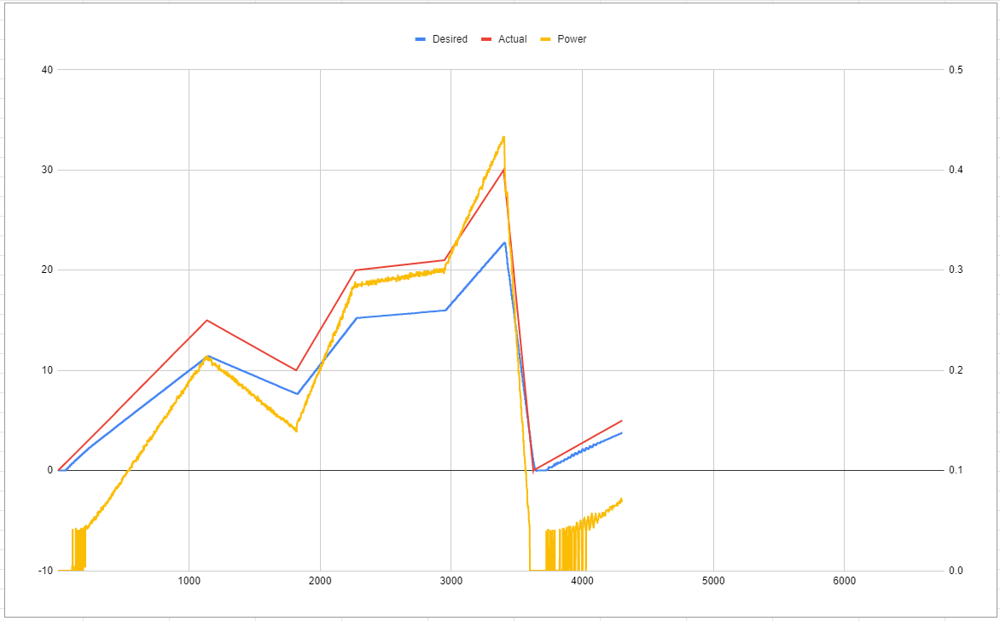

# Friday 9/16/2022

### Software - Anshal

Had my first look at the actual code and the actual setup, and popped in my code with separate arrays of position and velocity points. Also fixed some issues with names of the namespaces.

Experimented with feedback, it seems that the parameter for pidIdx needs to be 1 for the feedback to even work.
`_talon.GetSelectedSensorPosition(1)` Gives angle data
`_talon.GetSelectedSensorVelocity(1)` Gives velocity data

Debugging with print statements is done with
`Debug.Print();`

### Hardware - Zachary

Pulled apart motor & diagnosis of damage

- damage induced due to "floating input" issue & overnight event
  - motor was left on, attached to arm, spinning at 120RPM, likely for multiple days
- motor left on, causing aluminum toothed hex shaft to be chewed through & destroyed

# Sunday 9/18/2022

### Software - Anshal

Attempted to tune PIDs by changing constants to (1,0,0.2), however the motor's gearbox immediately broke, so tuning is delayed until that being fixed. 

For the rest of the workday, worked on making the brake work. It's very simply a digital pin connected on FY-5 (5.5)

Note to set up an enum for all the Ports so you can do FY.Pin5 for ease of use

How to set up a pin for use:
`OutputPort brakeSSR = new OutputPort(CTRE.HERO.IO.Port5.Pin5, false);`

Using a pin can be done with:
`brakeSSR.Write(true);`

Rememeber that the brake module is disabled when the pin is set to true.

Also remember to find out how to change the letter of a pin.

### Hardware - Zachary

Development of CREATE project

- printing and model development
  - created new base plate, adding fixtures for sling

Brake

- implemented brake physically
  - learned how to affix properly

# Monday 9/19/2022

### Software - Anshal

Had nothing to work on, as the motor was broken, so didn't come in today.

### Hardware - Zach

Met with Maziar, defined problem statement for CREATE, and did 3D print work 

# Tuesday 9/20/2022

### Software - Anshal

Had nothing to work on, as the motor was broken, so didn't come in today.

### Hardware - Zachary

Met with CREATE team and developed next steps for both HS outreach, as well as MAE150 project steps

- CREATE 
  
  - 2 phase design process
    1. Students in classroom build marshmallow bridges to learn about statics & design process.
    - sub goal of developing intuitive understanding of stress
    - we supplement with 3D CAD after project, giving a simulation of some bridge designs and what the stresses look like
      - IDEA: actually model some the students made?
    2. Design for launch adapted
    - create singular wall structure with least amount of filament possible
    - must be able to withstand 6G environment in centrifuge
      - teach CAD (TinkerCAD) & 3D printing, along with itterative design, kinematics, gravity, etc

- Next Steps: 
  
  1. follow up with Tali for cirriculum redesign so we can match & cater project
  2. Get access to TinkerCAD to learn how to better teach
  3. Get access to 3D printer specs & software

# Wednesday 9/28/2022

### Software - Anshal

Motor was fixed today, so I came in to tune pids. 

Defaults work badly, but definitely faster than the 1,0,0.02. We need to get controller to do solid PID tuning, so until then just messing around with Matlab tuning has been enlightening but as of yet, no results.

It seems that initializing the sensor causes wierd errors:
`_talon.ConfigSelectedFeedbackSensor(FeedbackDevice.CTRE_MagEncoder_Absolute, 1);`

Initially that parameter was 0, and when it was 0 it just straight up didn't stop. Changing it to 1 made it stop, and removing it has done the same.

That was removed, and since then its been working better.

Still need to fix that stupid CAN frame not received error. It barely actually sends frames, but I remember it not doing this a few weeks ago. Wierd.

Note to bring in custom arduino controller in, potentially uses D-input.

### Hardware - Zachary

```
For Zach to fill in
```

# Friday 9/30/2022

### Software - Anshal

Motor started out today fixed, ran some simple profiles, and it seems to be trying to stop again, which is good, but the errors are still coming in, which is bad

On a terrible note, I was a bit too late to hit the stop on one of the runs and heard something of a snap, and now the motor kinda just grinds.

On a separate note, it doesn't seem like the preprocessor directives are working with multiple profiles, need to test that again

Since motor was broken, wrote all of the PID tuner code, given that the arduino controller works. Note: it actually uses xinput, but theres a way to use xinput with the HERO, so that works.

Need to add an automatic rule that if the motor is decceling it just sets pid to 0,0,0,0

Also need to see if it is possible to increase the rate at which frames are given from the FX, it seems we're still getting garbage response.

Macro for FY, AUSX, etc. didn't work.

### Hardware - Zachary

```
For Zachary to fill out.
```

# Monday 10/3/2022

### Software - Anshal

Started with fixing up some modes on PID Tuner, current pids are far too agressive with no load, but the controller broke midway

Swapped over to working on motion profiling, since that was the main objective of today, figured out how to turn on Coast mode in code, other than that, little progress. Emailed support about the memory issue, since the 3001 point profile is too big, and our actual profile is 60k points, so thats an important issue that needs to be fixed.

# Wednesday 10/5/2022

### Software - Anshal

Got responses to my emails, and learned how to:

- Interpolate (WIP)

- Increase status frame windows (WIP)

- Set up the sensor correctly

Still need to figure out how to increase the duration between points, and make sure that the interpolation works correctly, because as of now it could be doing anything and I wouldn't know.

# Thursday 10/6/2022

### Software - Anshal

Spent more time testing the existing setup, so no avail. Going to try and set up custom motion profile code and interpolation, which should theoretically use far less space and linearly interpolate between the points.

The built-in interpolation uses a positional and velocity thing, but we don't care about the positon, and it prioritizes position, which is not what we want.

My new code should interpolate between points of (Velocity, Time), which is what we want anyway.

# Friday 10/7/2022

### Software - Anshal

Wrote my interpolation code at home, then came in to test it on the free-floating motor. It started out rapidly vibrating back and forth, due to very bad PID.

After the PIDs got toned down a lot, the motor started moving slower, and it WORKS.

After a slight bit of debugging, the motor interpolates the correct intended speed, and it actually sends that to the motor. Since all the PID is done on-motor, we don't have to worry about any lag in that regard, but we do need to consider lag for the brake module.

The PIDs will need to be redone on the actual rig, so theres no point tuning beyond a base level of functionality on the free-floating motor.  

We also need to test how many points we can get on this thing, so Zach can use the best resolution for the profile generator.

At this point, all thats left is tuning, adding the brake, and Zach writing matlab code to actually generate a new profile on the new format.

# Monday 10/10/2022

### Software - Anshal

Set up a google sheets that will help me visualize the profile, and where the motor is deviating from that. The [Error Visualizer - Google Sheets](https://docs.google.com/spreadsheets/d/1IiduuXmp9zJL7my34VadO7g3zJd_v2-7pjls4qTtzgY/edit?usp=sharing) also has a graph for the power out of the motor, so I can tell how much current is being sent out of the motor. When the motor is braking or in any way decceling, that current should be 0.



Second half of the workday, I set up braking as it related to the motor following the profile. Today I only set up simple on/off braking. In the future I'll be adjusting the threshold for braking as well as making it feather.

Above is a photo of a random profile I ran and how it looks on the visualizer. The Desired and Actual labels are reversed

# Monday 10/17/2022

### Software - Anshal

Had to hard grind classes for the past week, so was unable to come in, but now I'm back for the last thing to do without the rig. 

Set up feather braking, need to conduct tests to make sure that a percentage value will appropriately feather, and need to see what the lowest period is that the brake can go.

The braking seems delayed from when the code needs it, so maybe code needs to look ahead and start braking preeptively, which is possible when we know the whole profile in advance. 

Fixed bug where motor moves during braking period

Wednesday, plans to come in at 5, Friday, plans to come in early morning before noon class.

Forgot cable for controller, so am unable to do joystick-enabled analog tests of the brake's feathering function.

# Wednesday 10/19/2022

### - Anshal

Zach showed me how to put in the motor. We put in the motor.

# Friday 10/28/2022

### Software - Anshal

Midterms delayed my coming in, plus no access to lab without key.

Regardless, today did pretty much only tuning. Peter reminded us that we need to tune the actuation voltage of the brake, so we tested the min and max of actuation on the potentiometer

Minimum was about 52-53. Maximum went past 100, so we set it to about 75, same as it was before.

# Monday 10/31/2022

### Software - Anshal

Today, tried to test out the profile to show Professor Maziar, It for some reason is not running fast enough. Don't know why, need to look at code at home.

# Friday 11/18/2022

### Software - Anshal

Figured out that the motor didn't run fast enough due to being capped at 30% for testing. Removed that, and it still worked wierdly. After a bit of digging around, the brake activator was set to <= 0, so if the brake value was at 0, it would stop motor movement and attempt to brake at 0%.

That bug was fixed, however since then, the motor has still not been topping 40RPM. This is bad. From what I know, we need about 120RPM to hit the G's we're looking for.

I've shown it to Zach, he says my "40" is definitely 120, so there's a good chance my calculations are off, and we don't need to go any faster. More testing is required

# Tuesday 11/22/2022

### Software - Anshal

More debugging of this 40RPM issue. It seems very clean and very unnatural that it settles on exactly 40RPM, which is 2400RPM on the motor. I've looked into the pheonix tuner, and there's no option that caps the speed this way. 

I've sent out an email to CTRE Support, we'll see how this turns out.

Further tests have led me to full send the motor, and to me it seems that the output is only capable of hitting 40RPM in the current rig. I'm not sure if it's drag, friction, the intertia, or all three.

Maybe there's a way to safely overclock the motor, or use this "Voltage Compensation" option.

Need to show Zach, make sure its actually below what we need, because if we need faster this is going to be a problem.

# Thursday 12/2/2022

### Software - Anshal

 Could not figure out what was wrong with either the motor or the calculations. Maziar ran a manual visual test of the rpm (Counted rotations in a minute), and found that the rpm was about double what I expected. 

Looked around in the CTRE docs, and turns out the ticks per rotation is 2048, not 4096. For some reason that constant was incorrect in the code beforehand. 

Changing this set the max speed to about 80, 81 rpm

After confirming with Maziar and Zach, this is enough to get us about 10gs, but optimally we don't need to go that high, since the acceleration to get us there is pretty mid.
